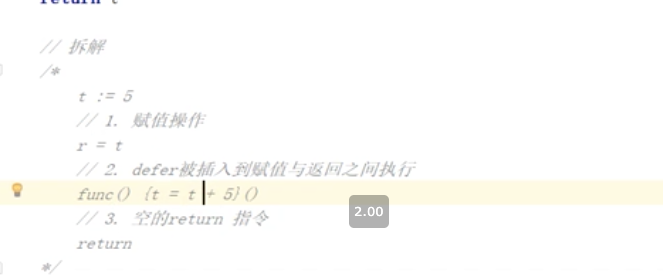

# Golang面试题搜集

go中常量是怎么实现
  
```go
  显式类型定义： const b string = "abc"
  隐式类型定义： const b = "abc"
```

DeepEqual 
```go
type S1 struct {
    Field int
}
type S2 struct {
    Field int
}

func main() {
    fmt.Println(reflect.DeepEqual(S1{1}, S2{1}))
}
```

https://juejin.cn/post/6881912621616857102
new 和 make的区别
  


https://learnku.com/docs/effective-go/2020/data/6243
.
如何优雅地关闭 channel

slice扩容原理
  建议看源码，默认翻倍，超过1024改为自增四分之一。不完全正确


内存对齐

- 取结构体各成员类型的对齐最大值,根据addr % align == 0 的原则填充 
  
- 完成1.后结构体整体占用的字节数需要是最大对齐值的整倍数原则，再进行补齐。

https://www.bilibili.com/video/BV1Ja4y1i7AF?from=search&seid=2263263322204363606

https://zhuanlan.zhihu.com/p/106933470

byte数组和int转换
  
  https://www.coder.work/article/1023024


- gpm 模型

  - work steal
  
  - hand off

https://www.bilibili.com/video/BV19r4y1w7Nx?p=2&spm_id_from=pageDriver

 defer
  - 对外部变量的引用方式有两种，分别是函数参数以及作为闭包引用。
  - 在作为函数参数的时候，在defer定义时就把值传递给defer，并被cache起来。
    如果是作为闭包引用，则会在defer真正调用的时候，根据整个上下文确定当前的值。
    
  - defer 与 return
    
    defer 开销(1.14后已解决)
    
- interface 
  - iface 包含方法的interface
  - eface 不包含方法的interface
```go
package main
import"io"
type myWriter struct{
}
/*func (w myWriter) Write(p []byte) (n int, err error) {
    return
}*/
func main(){
// 检查 *myWriter 类型是否实现了 io.Writer 接口
var _ io.Writer=(*myWriter)(nil)
// 检查 myWriter 类型是否实现了 io.Writer 接口
var _ io.Writer= myWriter{}
}
```

go的垃圾回收

- go 垃圾回收触发方式 

  - 阈值：默认内存扩大一倍, 启动gc
  - 

## 2.go的内存管理 三色标记算法
Golang三色标记+混合写屏障GC模式全分析 - 刘丹冰Aceld的文章 - 知乎
https://zhuanlan.zhihu.com/p/334999060

## 3.函数中传值 还是 传指针

## 4.线程有几种模型 Goroutine协程的原理，讲一下实现和优势

## 5.如果Goroutine一直占用资源怎么办,PMG模型怎么解决的这个问题

## 6.Goroutinue的状态流转

## 7.go线程的状态流转 自旋 和 非自旋状态

## 8.如果若干线程中一个线程OOM,会发生什么？如果是Goroutine呢。

## 9.项目中错误处理怎么做

## 10.defer可以捕获到goroutine的子Goroutine的panic么
不可以 只能捕获当前goroutine的panic
## 11.go的内存模型

## 12.goroutine 的大小

<details>

  <summary>go的内存模型</summary>

  https://golang.org/ref/mem 

  https://chai2010.cn/advanced-go-programming-book/ch1-basic/ch1-05-mem.html

https://chai2010.cn/advanced-go-programming-book/ch1-basic/ch1-05-mem.html

</details>


- 新建一个 chan 后，内存在堆上分配，大概长这样：


https://www.bookstack.cn/books/qcrao-Go-Questions
