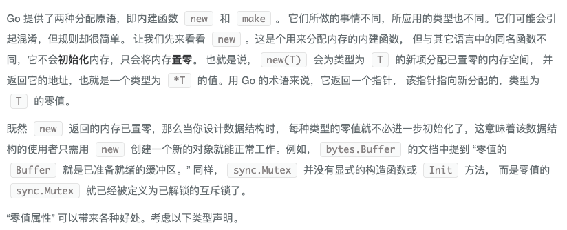
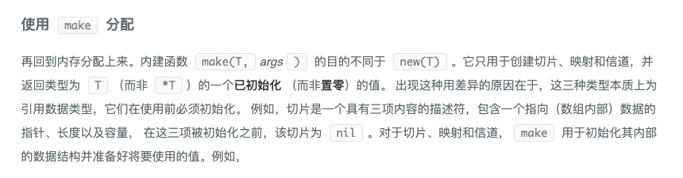
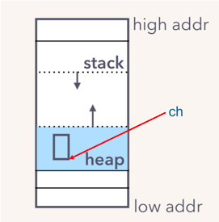

# Golang面试题搜集

- go中常量是怎么实现
  
```go
  显式类型定义： const b string = "abc"
  隐式类型定义： const b = "abc"
```

- DeepEqual 
```go
type S1 struct {
    Field int
}
type S2 struct {
    Field int
}

func main() {
    fmt.Println(reflect.DeepEqual(S1{1}, S2{1}))
}
```

https://juejin.cn/post/6881912621616857102
- new 和 make的区别
  


https://learnku.com/docs/effective-go/2020/data/6243
.
- 如何优雅地关闭 channel

- slice扩容原理
  建议看源码，默认翻倍，超过1024改为自增四分之一


- byte数组和int转换
  
  https://www.coder.work/article/1023024

## 2.go的内存管理 三色清扫标记算法

## 3.函数中传值 还是 传指针

## 4.线程有几种模型 Goroutine协程的原理，讲一下实现和优势

## 5.如果Goroutine一直占用资源怎么办,PMG模型怎么解决的这个问题

## 6.Goroutinue的状态流转

## 7.go线程的状态流转 自旋 和 非自旋状态

## 8.如果若干线程中一个线程OOM,会发生什么？如果是Goroutine呢。

## 9.项目中错误处理怎么做

## 10.defer可以捕获到goroutine的子Goroutine的panic么
不可以 只能捕获当前goroutine的panic
## 11.go的内存模型

## 12.goroutine 的大小

<details>

  <summary>go的内存模型</summary>

  https://golang.org/ref/mem 

  https://chai2010.cn/advanced-go-programming-book/ch1-basic/ch1-05-mem.html

https://chai2010.cn/advanced-go-programming-book/ch1-basic/ch1-05-mem.html

</details>


- 新建一个 chan 后，内存在堆上分配，大概长这样：


https://www.bookstack.cn/books/qcrao-Go-Questions
